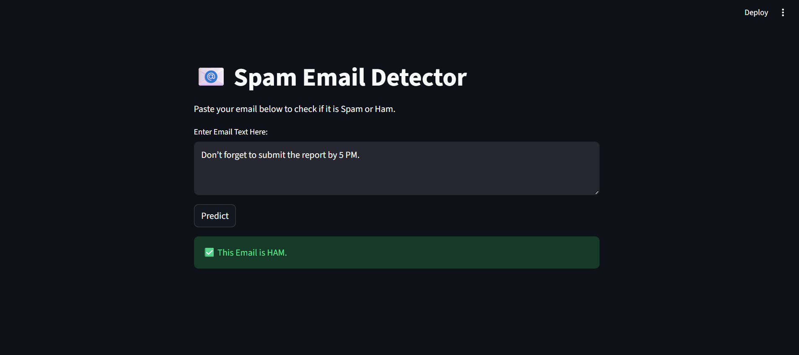
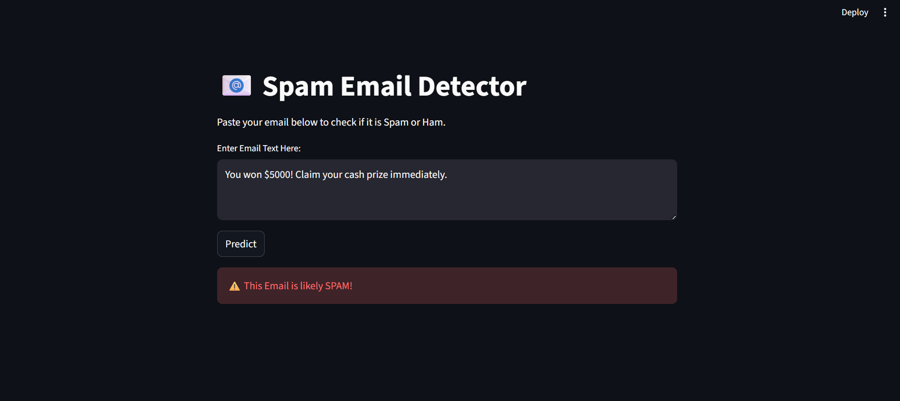

# 📧 Spam Email Detection App

A **Machine Learning and NLP project** to detect whether an email is **Spam** or **Ham (not spam)**. This app uses a **TF-IDF + Custom Features ensemble model** to classify emails and provides an interactive **Streamlit UI**.

---

## 🧰 Features

- Detects spam emails using a **voting ensemble of Naive Bayes, Logistic Regression, and Random Forest**.
- Combines **TF-IDF vectorization** with **custom features** (like number of exclamations, numbers, spam keywords, etc.).
- Interactive web interface using **Streamlit**.
- Shows predictions instantly:  
  - ✅ Ham (Not Spam)  
  - ⚠️ Spam  

---

## 💾 Dataset

- The model is trained on the **Email Dataset**.
- The dataset contains `ham` and `spam` labeled emails.
- Dataset CSV file used: `spam.csv`  

---

## ⚡Technologies

- Python

- pandas, numpy

- scikit-learn

- nltk, wordcloud

- Streamlit

- Matplotlib, Seaborn

---

## 📝 Project Structure

```
Spam_Email_Detection/
│
├── data/
│   └── spam.csv
│
├── models/
│   ├── ensemble_spam_model.pkl
│   └── tfidf_vectorizer.pkl
│
├── reports/
│   ├── wordclouds
│   └── distribution_plots
│
├── app.py
│
├── notebook.ipynb
│   └── Spam_Email_NLP.ipynb
│
├── requirements.txt
│
└── README.md
```

---

## 🖼 Screenshots

### ✅ Ham


### ⚠️ Spam


---

## 🧠 How It Works

**1. Preprocessing:**
- Convert text to lowercase.
- Remove punctuation and stopwords.

**2. Feature Engineering:**
- TF-IDF vectorization.
- Custom features like number of exclamations, numbers, and spam keywords.

**3. Model:**
- Voting ensemble with Naive Bayes, Logistic Regression, and Random Forest.

**4. Prediction:**
- Returns **Spam** or **Ham** based on model output.

---

## 🔗 Connect with Me

**Kadulla Pravalika**
- GitHub: [Kadulla-Pravalika-28](https://github.com/Kadulla-Pravalika-28)  
- LinkedIn: [linkedin.com/in/kadulla-pravalika](https://www.linkedin.com/in/kadulla-pravalika/)  

---

## 📄 License

This project is licensed under the **MIT License** – See the [LICENSE](./LICENSE) file for details.

